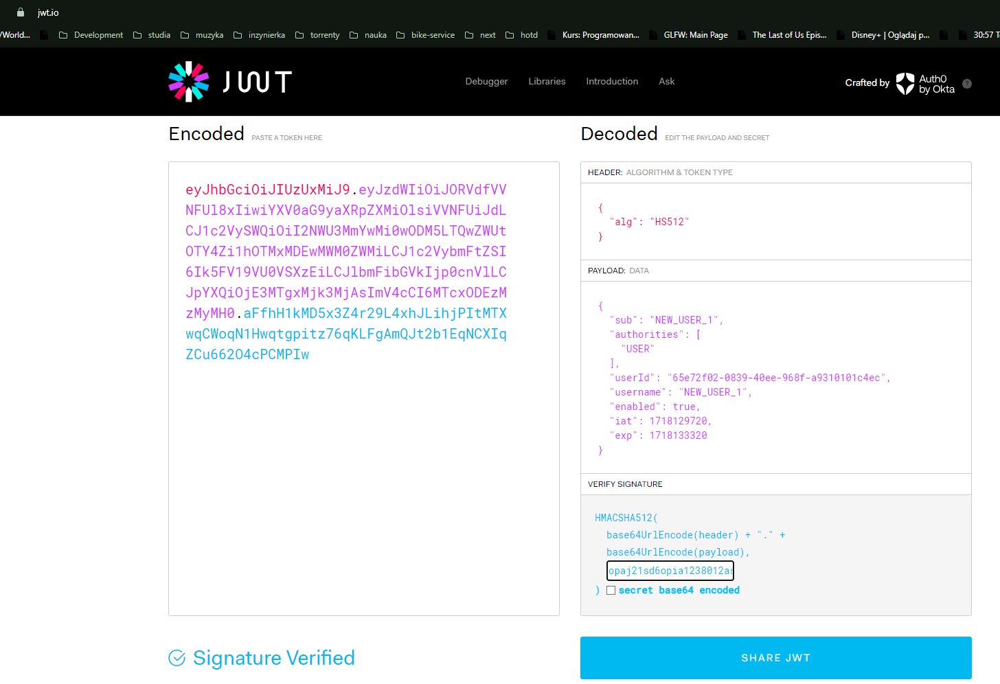

# BAI_PROJECT

Server side "Księgarnia" built with Java EE.

## To run application:
Download Tomcat 10.1.20 via https://dlcdn.apache.org/tomcat/tomcat-10/v10.1.20/bin/apache-tomcat-10.1.20.zip

Next add tomcat application server and choose it for LibraryEE run configuration.

Load mvn dependencies and build application with `mvn clean install`.

Configure own database for postgresql in persistence.xml - Mainly `PLACEHODLER` values or even `hibernate.connection.url` property.

Run LibraryEE :)

Security failures to implement:
SQL injection
XSS
Privileges escalation
Path traversal

SQL injection example as username in login:
```
TODO
```

XSS example as description of book:
```
\<a onmouseover="alert(document.cookie)"\>xxs link\</a\>
```

Privileges escalation via jwt token tampering:
Modify token data via https://jwt.io with proper jwt.secret.key inserted, example change roles
